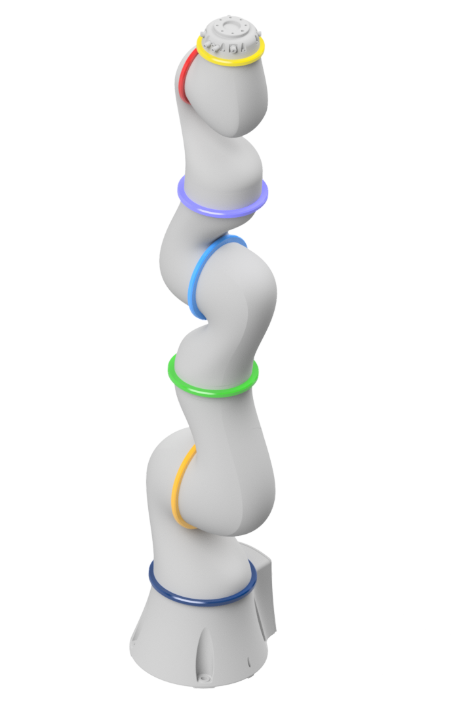

# Analytical Inverse Kinematics for the KUKA LBR 4+ (MATLAB)

A fully analytical, geometric inverse kinematics (IK) solution for the 7-DOF
**KUKA LBR 4+** (LWR IV+) lightweight robot, implemented in MATLAB/Octave. The
solution is non-iterative and deterministic: the redundant degree of freedom is
resolved through a single parameter — the extra axis **E1** (joint 3) — after
which the remaining six joints are solved in closed form by splitting the arm
into a regional structure (CBB) and a local structure (spherical wrist).

The repository contains the forward kinematics, an inverse-kinematics solver
that enumerates all reachable solutions with a joint-limit filter, a null-space
analysis showing the self-motion of the arm as E1 is varied, and a numerical
round-trip validation.

> The kinematic parameters in this code are those of the **KUKA LBR 4+ / LWR IV+**.
> The same geometric method applies to the **LBR iiwa**; only the DH parameters and joint limits change.

---

## Contents

<table>
<tr>
<td valign="top">

- [Overview](#overview)
- [Background](#background)
- [Method](#method)
- [Theory and equations](#theory-and-equations)
- [Kinematic model](#kinematic-model)
- [Repository structure](#repository-structure)
- [Requirements](#requirements)
- [Usage](#usage)
- [Validation](#validation)
- [Implementation notes and pitfalls](#implementation-notes-and-pitfalls)
- [References](#references)
- [License](#license)

</td>
<td valign="top" width="45%">

<!-- Add your rendered robot image to docs/kuka_lbr4.png -->


</td>
</tr>
</table>

---

## Overview

The LBR 4+ is a redundant 7-axis robot: for a given end-effector pose there are
infinitely many joint configurations. This redundancy is resolved by treating
joint 3 as a free **extra axis E1** and fixing it to a chosen value (0° by
default). With E1 fixed the arm reduces to a 6-DOF problem with a spherical
wrist, which is solved geometrically.

The regional structure (axes 1, 2, 4) yields two shoulder solutions × two elbow
solutions, and the local structure / spherical wrist (axes 5, 6, 7) yields two
orientation variants — up to **eight** candidate solutions, which are then
filtered against the hardware joint limits.

This repository contains:

- a **forward kinematics** in standard DH for reference and verification,
- an **inverse-kinematics solver** returning all reachable solutions with a
  joint-limit filter **and a forward-kinematics consistency check** that
  discards extraneous roots,
- a **null-space analysis** (`inverse_kinematics_nullspace`) showing the
  self-motion of the arm as the extra axis E1 is varied,
- a **validation script** (round-trip FK → IK → FK plus null-space consistency),
- a **demo** that exercises all of the above.

---

## Background

A serial manipulator can be split into a *regional structure* (the first three
main axes, which set the position) and a *local structure* (three intersecting
wrist axes, which set the orientation). When the last three axes intersect in a
single point — a spherical wrist, or *Zentralhand* — the inverse kinematics
decouples into a position problem and an orientation problem (Pieper's result).

Unlike the Franka Emika Panda, which has linear offsets at the elbow and wrist,
the KUKA LBR 4+ has **no link offsets** (all `a` parameters are zero) and a
spherical wrist, so this classic decoupling applies directly:

1. The **wrist point** is found by stepping back from the TCP along the tool
   axis. Because the wrist is spherical, its position depends only on axes 1–4.
2. Axes **1, 2, 4** are obtained from the wrist-point geometry.
3. Axes **5, 6, 7** are obtained from the residual orientation between frame 4
   and the requested TCP orientation.

The seventh degree of freedom (the elbow self-motion of the redundant arm) is
exposed as the extra axis **E1 = joint 3**. Sweeping E1 traces the null space:
the family of joint configurations that all reach the identical TCP pose.

---

## Method

The solution is computed in a fixed order (after fixing E1):

1. **Build the TCP pose** from the requested position and RPY orientation.
2. **Wrist point** — step back from the TCP by `d7` along the tool z-axis.
3. **Axis 1** — `atan2` of the wrist-point projection; two shoulder solutions.
4. **Axis 2** — planar two-link geometry via a half-angle tangent
   substitution; two elbow solutions.
5. **Axis 4 (elbow)** — from the same shoulder–elbow–wrist triangle.
6. **Axis 3 (E1)** — fixed to the redundancy value (0° in `inverse_kinematics`,
   a free input in `inverse_kinematics_nullspace`).
7. **Axes 5, 6, 7 (spherical wrist)** — from the residual orientation
   `R₄ᵀ·R₇`; two wrist variants.
8. **Verify** every candidate with the forward kinematics and discard any that
   do not reproduce the requested pose (see the pitfalls below).

This yields up to 2 (shoulder) × 2 (elbow) × 2 (wrist) = 8 candidate solutions.
They are passed through `apply_axis_limits` (joint ranges) and then through a
forward-kinematics check, so only configurations that actually reach the
requested pose are returned.

---

## Theory and equations

### Standard-DH transform

```
        | cos θ   -sin θ·cos α    sin θ·sin α    a·cos θ |
A_i  =  | sin θ    cos θ·cos α   -cos θ·sin α    a·sin θ |
        |   0         sin α           cos α          d   |
        |   0           0               0           1    |
```

Forward kinematics to the TCP is the chained product
`T_TCP = A1·A2·A3·A4·A5·A6·A7`.

### Wrist point

The spherical-wrist point is the TCP translated back along the tool z-axis by
the flange length `d7 = 78 mm`:

```
T_S = T_TCP · Trans_z(d7)⁻¹
[X_S, Y_S, Z_S] = T_S(1:3, 4)
```

### Axis 1 (shoulder rotation)

```
q1 = atan2(Y_S, X_S)     (with a branch giving the second shoulder solution q1 ± π)
```

### Axis 2 (planar two-link, half-angle substitution)

With `l2 = 400 mm`, `l3 = 390 mm` and the wrist point in the arm plane:

```
B = Z_S − d1
A = ± √(X_S² + Y_S²)
C = (A² + B² − l3² + l2²) / (2·l2)

t  = B/(A+C) ± √(B² − C² + A²)/(A+C)
q2 = atan2( 2t/(1+t²),  (1−t²)/(1+t²) )
```

The `±` on `A` selects the shoulder solution; the `±` in `t` selects the elbow
configuration.

### Axis 4 (elbow)

```
β  = atan2( B − l2·sin q2,  A − l2·cos q2 )
q4 = q2 − β
```

### Redundant case (E1 ≠ 0)

When the extra axis is prescribed, axes 1 and 2 follow from the closed-form
system (with `s_i = sin δ`, `c_i = cos δ`):

```
a_z·c2 + b_z·s2 = c_z ,   a_z = d3 + d5·c4 ,  b_z = d5·s4·c3 ,  c_z = Z_S − d1
a_x·c1 + b_x·s1 = c_x ,   a_y·c1 + b_y·s1 = c_y
```

solved by the same half-angle substitution for axis 2 and a linear elimination
for axis 1. This is implemented in `inverse_kinematics_nullspace`.

### Axes 5, 6, 7 (spherical wrist)

With axes 1, 2, 4 and E1 known, the rotation of frame 4 in the base frame `R₄`
is evaluated, and the residual wrist orientation is

```
R_7_4 = R₄ᵀ · R₇                 (R₇ = requested TCP orientation)

q5 =  atan2( R_7_4(2,3),  R_7_4(1,3) )
q6 = −acos( R_7_4(3,3) )
q7 =  atan2( R_7_4(3,2), −R_7_4(3,1) )
```

with a second wrist variant `q5' = q5 − π,  q6' = −q6,  q7' = q7 + π`.

---

## Kinematic model

<table>
<tr>
<td width="38%" valign="top">

<!-- Add your rendered robot image to docs/kuka_lbr4.png -->


</td>
<td valign="top">

Standard Denavit–Hartenberg parameters of the KUKA LBR 4+. <br/>
Joint 3 is the redundancy axis **E1**. <br/>
The θ badges are colour-matched to the joint rings in the render.

| Frame        | d [mm] | θ | a [mm] | α |
|:------------:|:------:|:--------------------------------------------------:|:-----:|:----:|
| Joint 1      | 310.5  |      | 0     | π/2  |
| Joint 2      | 0      |      | 0     | −π/2 |
| Joint 3 (E1) | 400    |      | 0     | −π/2 |
| Joint 4      | 0      |      | 0     | π/2  |
| Joint 5      | 390    |      | 0     | π/2  |
| Joint 6      | 0      |      | 0     | −π/2 |
| Joint 7      | 78     |      | 0     | 0    |

</td>
</tr>
</table>

> **Note on Joint 2:** the IK returns axis 2 as the geometric angle, which is
> the DH angle θ₂ plus 90°. Equivalently, KUKA reports axis 2 with a −90° home
> offset relative to θ₂ (see `demo.m` and `validate.m`).

### Joint limits (as used in the code)

| Axis    | Range          |
| ------- | -------------- |
| A1      | ± 170°         |
| A2      | −30° … +210°   |
| A3 (E1) | ± 170°         |
| A4      | ± 120°         |
| A5      | ± 170°         |
| A6      | ± 120°         |
| A7      | ± 170°         |

---

## Repository structure

| File                              | Purpose                                                                       |
| --------------------------------- | ----------------------------------------------------------------------------- |
| `dh_transform.m`                  | Single 4×4 standard-DH transformation matrix.                                 |
| `forward_kinematics.m`            | Forward kinematics: chains the seven DH matrices to the TCP pose.             |
| `inverse_kinematics.m`            | **Main solver.** Returns all reachable solutions (incl. joint-limit filter).  |
| `inverse_kinematics_nullspace.m`  | Null-space motion: re-solves the same pose for a chosen extra-axis E1 value.  |
| `euler_to_rotation.m`             | Euler/RPY angles → rotation matrix (`ZYZ` and `RPY` conventions).             |
| `rotation_to_euler.m`             | Rotation matrix → Euler/RPY angles.                                           |
| `apply_axis_limits.m`             | Joint-limit check and ±360° wrap normalisation.                               |
| `validate.m`                      | Round-trip FK → IK → FK validation and null-space consistency check.          |
| `demo.m`                          | Runnable example for forward, inverse, and null-space kinematics.             |

---

## Requirements

- **MATLAB R2018b** or later, **or** GNU Octave.
- No additional toolboxes required — the scripts use base functions only
  (`array2table` in `demo.m` is only used for display).

---

## Usage

### Quick start

```matlab
demo        % run from the repository root
```

### Forward kinematics

Joint angles in radians; output is the 4×4 base→TCP transform.

```matlab
thetaDeg = [-74.77; 154.09 - 90; 0; 92.93; 2.61; -38.49; 1.39];  % note −90° on axis 2
q = deg2rad(thetaDeg);
T   = forward_kinematics(q(1), q(2), q(3), q(4), q(5), q(6), q(7));
rpy = rotation_to_euler(T(1:3, 1:3), 'RPY');   % orientation in degrees
```

### Inverse kinematics

Inputs: TCP position `X, Y, Z` in millimetres and orientation `A, B, C` as
roll-pitch-yaw in degrees.

```matlab
solutions = inverse_kinematics(-24.11, 96.88, 857.01, -65.90, 67.14, 6.55);
% Each row is one valid joint configuration [deg]: [A1 A2 A3(E1) A4 A5 A6 A7]
```

### Null-space analysis

```matlab
q  = deg2rad([-74.77; 64.09; 0; 92.93; 2.61; -38.49; 1.39]);
ns = inverse_kinematics_nullspace(q(1), q(2), deg2rad(20), q(4), q(5), q(6), q(7));
```

### Validation

```matlab
validate    % round-trip FK -> IK -> FK over 1000 random configurations
```

---

## Validation

`validate.m` performs two independent checks:

1. **Round-trip FK → IK → FK.** For `N = 1000` random configurations the TCP
   pose `P = FK(q)` is computed, the IK is solved for `P`, and FK is evaluated
   again for *every* returned solution. Each solution must reproduce `P`, so the
   residual `‖FK(IK(FK(q))) − FK(q)‖` is expected to fall to machine precision.
2. **Null-space consistency.** For one configuration the redundancy axis E1 is
   swept from −120° to +120°; every null-space solution must reproduce the same
   TCP pose.

The comparison is done on the full pose: Euclidean distance for position and the
rotation angle of `R_targetᵀ·R_check` for orientation. The script discards any
complex-valued solutions (from `acos`/`sqrt` near singular configurations) and
reports how many were skipped.

Because both solvers verify their candidates against the forward kinematics,
every returned solution reproduces the target pose to machine precision. Results
over `N = 1000` random configurations and a 25-step E1 sweep:

| Check                | Configurations  | Position error, max [mm] | Position error, median [mm] |
| -------------------- | --------------- | ------------------------ | --------------------------- |
| Round-trip FK→IK→FK  | 975 / 1000      | 6.99e-11                 | 2.07e-13                    |
| Null-space sweep     | 16 solutions    | 1.20e-12                 | 7.92e-13                    |

The orientation error stays at the same level (round-trip max ≈ 1.7e-6°, median
0°). The residual is pure floating-point accumulation, far below the robot's
mechanical repeatability.

The 25 round-trip configurations reported as "skipped" are poses that, with the
redundancy axis fixed at E1 = 0, are not reachable (the axis-2 discriminant is
negative) — this is expected, not an error. Likewise, only the E1 values that
keep the pose reachable yield solutions during the null-space sweep.

---

## Implementation notes and pitfalls

- **Axis 2 convention (−90°).** The IK returns axis 2 as the geometric angle;
  the DH angle is θ₂ = (returned A2) − 90°. `validate.m` applies this offset
  when feeding solutions back into the forward kinematics — exactly what the IK
  does internally when it rebuilds the wrist frame.

- **Standard vs. modified DH.** This model uses the **standard** (distal) DH
  convention. The transform matrix and the parameter set must match — mixing a
  standard parameter set with a modified-DH transform silently produces a
  different, wrong robot.

- **Redundancy is fixed at E1 = 0 in `inverse_kinematics`.** The full redundancy
  is exercised via `inverse_kinematics_nullspace`, where E1 is a free input.

- **`apply_axis_limits` return value.** A valid solution is returned as a numeric
  `1×7` row; an invalid one is returned as a *non-numeric* sentinel
  (`false` / `"false"`). Callers detect validity with `isnumeric(...)`, which is
  why the invalid case is a sentinel rather than an empty array (indexing an
  empty array would error).

- **Extraneous roots are filtered.** The half-angle substitution involves a
  squaring step, which can introduce candidate solutions that satisfy the joint
  limits but do not reproduce the target pose ("ghost solutions"). Both solvers
  therefore run each candidate back through the forward kinematics and keep only
  those matching the requested pose to numerical precision.

- **Unreachable redundancy angles.** When a chosen E1 value leaves the pose
  unreachable, the axis-2 discriminant `b_z² − c_z² + a_z²` goes negative.
  `inverse_kinematics_nullspace` checks this and returns an empty result instead
  of producing complex angles.

- **Numerical robustness.** Near singular configurations, `sqrt`/`acos`
  arguments can drift just outside their domain. The wrist `acos` is clamped to
  [−1, 1]; complex candidates are discarded by the consistency check.

This is a cleaned-up, fully translated version of an earlier university project.
The mathematics of the original solver is unchanged; only the joint-limit and
forward-kinematics consistency checks described above were added.

---

## References

The geometric solver follows the regional/local-structure (CBB + spherical
wrist) decomposition taught and derived by Prof. Dr.-Ing. Ali Kanso, after the
Pieper/Craig closed-form approach for manipulators with a spherical wrist.

- Kanso, A. (2021). *Konzeption und Realisierung einer sensitiven Montageaufgabe
  basierend auf einem Handhabungsgerät und intelligenter Sensorik für den
  Wickelprozess endloser Gummidichtungen.* Dissertation, Universität des
  Saarlandes, Saarbrücken. (Ch. 3 — kinematic fundamentals and the geometric
  inverse-kinematics method.)
  <https://publikationen.sulb.uni-saarland.de/handle/20.500.11880/31481>
- Pieper, D. L. (1968). *The Kinematics of Manipulators under Computer Control.*
  PhD thesis, Stanford University.
- Craig, J. J. (2005). *Introduction to Robotics: Mechanics and Control* (3rd
  ed.). Pearson.
- Denavit, J. & Hartenberg, R. S. (1955). *A kinematic notation for lower-pair
  mechanisms based on matrices.* Journal of Applied Mechanics.
- Siciliano, B., Sciavicco, L., Villani, L. & Oriolo, G. (2009). *Robotics:
  Modelling, Planning and Control.* Springer.
- KUKA — LBR 4+ / LWR product documentation (kinematic parameters
  and joint limits).

---

## License

Released under the **MIT License** — free to use, modify, and distribute with
attribution.
